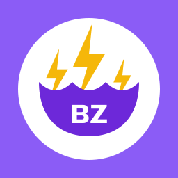

# BrollyZapper



[](https://github.com/davotoula/brollyzapper/actions/workflows/ci.yml)
[](https://github.com/davotoula/brollyzapper/actions/workflows/codeql.yml)
[](https://scorecard.dev/viewer/?uri=github.com/davotoula/brollyzapper)
[](https://github.com/davotoula/brollyzapper/releases/latest)
[](go.mod)
[](LICENSE)

Nostr zap receiving (NIP-57) and Nostr Wallet Connect (NIP-47) for an **existing** LND node,
packaged as an Umbrel app and runnable in plain Docker Compose beside an LND you already run on
the same host. Safety over features.

It serves its own lightning address — nothing external is required, no Alby, no LNURL host, no
static file to keep in sync — publishes zap receipts to nostr, and lets a wallet pay through
your node over NWC. Two containers: a **server** that holds all the attack surface
(HTTP, relays, the database), and a **guard** that alone holds the node's admin credential and
hands the server only the narrower ones it needs. A fresh install is **receive-only**: sending
stays off until you complete an authorisation step the app walks you through, which bakes a
second, separately revocable credential with a spending ceiling you choose.

## Install on umbrelOS

You need the **Lightning Node** app installed and synced — BrollyZapper reads that node's
certificate and admin macaroon through Umbrel's own app exports and runs no node of its own.

Until the [official App Store listing](https://github.com/getumbrel/umbrel-apps/pull/6049) is
merged, install from the community store:

1. In the umbrelOS **App Store**, click the three dots (top right) → **Community App Stores**.
2. Paste `https://github.com/davotoula/brollyzapper-umbrel-store` and click **Add**.
3. Open the new store and install **BrollyZapper**.

Updates arrive through the store like any other app. The same app id is what the official
listing will carry, so your data and settings carry over.

## Install outside Umbrel

For an LND on the same Linux host, in Docker beside the app or installed on the host itself.
Docker Desktop is out: its shared filesystem breaks the guard's socket.

The template is [`deploy/`](deploy/), and [`DEPLOYING.md` §Running outside
Umbrel](DEPLOYING.md#running-outside-umbrel) is the procedure: five install steps, and the snags
a first start meets — a node certificate that does not name the address the app dials, LND's gRPC
still listening on loopback only, and LND's files unreadable by the user the containers run as —
with the fix for each.

Set **`ADMIN_PASSWORD`** (at least 12 characters) in `.env` before the first start; the server will
not start without it. Change it later in **Settings**, not in `.env`.

LND on another machine is not supported: both credentials the guard bakes are locked to this
container's source address, and [DEPLOYING §9](DEPLOYING.md#9-not-supported-lnd-on-another-machine)
says why that cannot simply be loosened.

## First run

Open the app and go to **Settings**. These are the five you touch at setup; every other setting,
its default and why, is in [`OPERATING.md`](OPERATING.md).

| Field | What it is |
|---|---|
| **Public domain** | The host your lightning address lives on. Enter it bare — `zap.example.com`. A pasted `https://` is stripped and the scheme remembered separately. |
| **Address name** | The part before the `@`. `test` gives `test@zap.example.com`. |
| **Relays** | Where receipts are published, one per line. Empty means the built-in default set. Receipts also go to whatever relays each zap request names. |
| **Incoming payments raise the ceiling** | Leave on to have received sats increase the spending authorisation. |
| **Public rate limit** | The global ceiling on anonymous traffic to your address. It governs the public callback only; read the rate-limiting section of [`DEPLOYING.md`](DEPLOYING.md#5-rate-limiting-at-the-edge--required-not-optional) before changing it. |

Save. The app immediately probes its own address over the public internet and the **Security**
page reports the result:

> Your lightning address reaches this instance — **pass**

That check fetches your own LNURL document and verifies the answer carries this instance's nostr
pubkey and a per-boot header only it emits — so a domain that points at some other server, which
resolves and responds and is silently broken, fails here rather than in a wallet. If it fails,
the page shows the reason verbatim; fix that before going further.

To check it by hand:

```bash
curl -s https://zap.example.com/.well-known/lnurlp/test | jq -r '.callback, .metadata, .nostrPubkey'
```

Expect a callback on your own domain, an identifier of `test@zap.example.com`, and a
64-character hex pubkey.

## Putting your address on the internet

A lightning address needs a hostname that reaches your box over HTTPS; Nostr Wallet Connect
works without one. A Cloudflare Tunnel is the recommended route — no port forwarding, no inbound
firewall hole — and three things about it are not optional:

- the tunnel speaks **HTTP** to the box, and its path is left empty;
- the two public paths, `/.well-known/lnurlp/*` and `/lnurlp/*`, are **never** behind
  Cloudflare Access, or zaps fail with no visible error;
- a **per-client rate limit at the edge** on `/lnurlp/` only, because behind a tunnel the app
  cannot see who is calling.

The procedure, how to verify it from outside your LAN, and how to confirm the rate limit fires
are in [`DEPLOYING.md`](DEPLOYING.md).

## Where everything else is

| | |
|---|---|
| [`DEPLOYING.md`](DEPLOYING.md) | Exposing the address (Cloudflare Tunnel, step by step), what is public, and the plain-Docker install procedure |
| [`OPERATING.md`](OPERATING.md) | Every setting and its default, sending and the two caps, backups, macaroon rotation, storage |
| [`CHANGELOG.md`](CHANGELOG.md) | What changed in each release |
| [`CONTRIBUTING.md`](CONTRIBUTING.md) | Layout, the build and test gate, the architecture rules, how a change lands |
| [`umbrel/`](umbrel/) | The App Store package and its submission notes |

## Licence

MIT — see [LICENSE](LICENSE).
